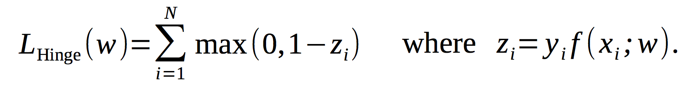
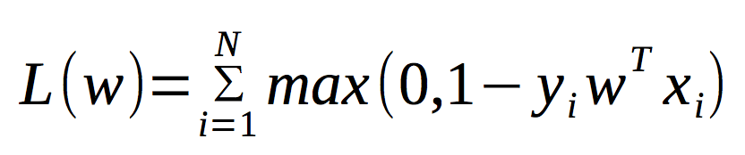
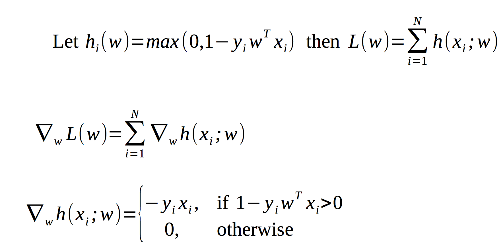

# Hige Loss 



Support vector machine and many maximum margin based models use the hinge loss.

Also, rectified linear units (ReLU) use a form the hinge function:
> When zi is linear in model parameters, then Hinge loss is convex in model parameters.

To minimize the following cost function:



Max() is not differentiable, so no gradient.But, we can use its subgradient (or
subderivative). Subderivative generalizes the derivative to nondifferentiable functions such as max(). 

This now becomes:




Matlab implemetation of hige loss function

Execute the main file. 
```sh
>> main.m
```

Below is a smaple output for linear separable data


Loss:


Visualise linear seperation:


