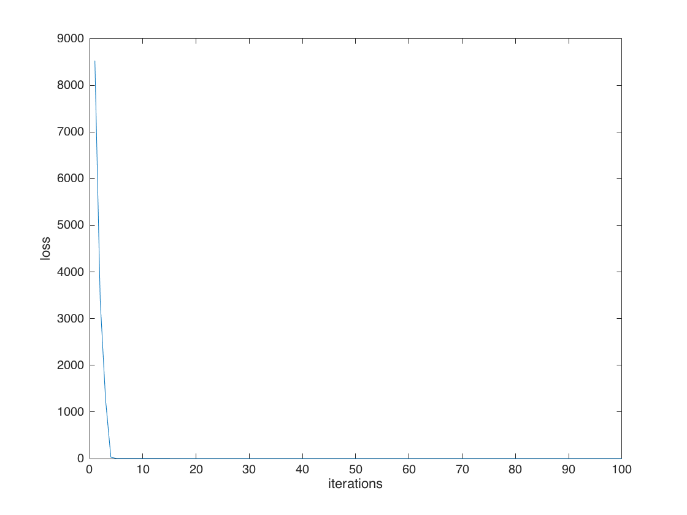
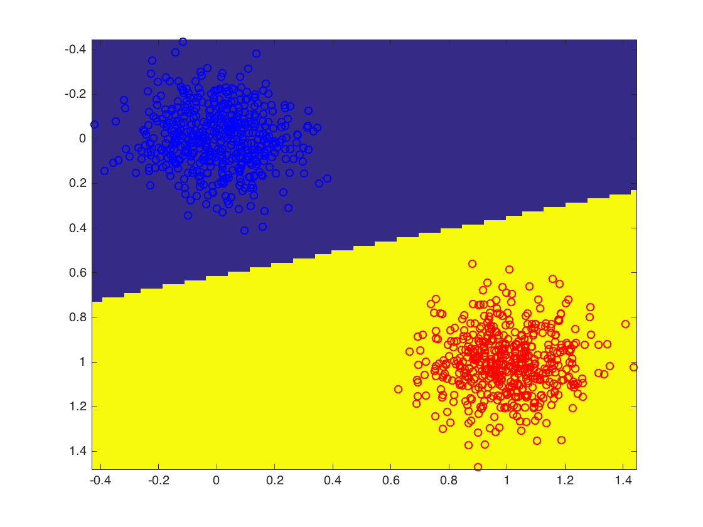

# Hige Loss 

Matlab implemetation of hige loss function

Execute the main file. 
```sh
>> main.m
```

Below is a smaple output for linear separable data


Loss:




Visualise linear seperation:



